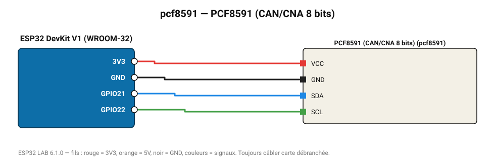

# PCF8591 (CAN/CNA 8 bits)

Module 4 entrées analogiques + 1 sortie (souvent livré avec LDR, thermistance et potentiomètre).

**Carte :** ESP32 DevKit V1 (WROOM-32) — moniteur série 115200 bauds.

| ESP32 | Composant | Broche | Couleur fil | Remarque |
|---|---|---|---|---|
| 3V3 | PCF8591 (CAN/CNA 8 bits) | VCC | rouge |  |
| GND | PCF8591 (CAN/CNA 8 bits) | GND | noir |  |
| GPIO21 | PCF8591 (CAN/CNA 8 bits) | SDA | bleu |  |
| GPIO22 | PCF8591 (CAN/CNA 8 bits) | SCL | vert |  |

Toujours câbler **carte débranchée**. Masse (GND) commune entre tous les modules.
