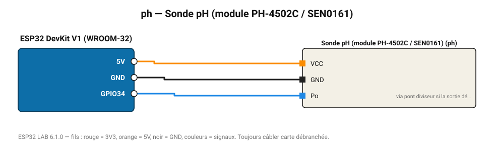

# Sonde pH (module PH-4502C / SEN0161)

Mesure du pH de 0 à 14 avec étalonnage deux points (tampons pH 4 et pH 7).

**Carte :** ESP32 DevKit V1 (WROOM-32) — moniteur série 115200 bauds.

| ESP32 | Composant | Broche | Couleur fil | Remarque |
|---|---|---|---|---|
| 5V (VIN) | Sonde pH (module PH-4502C / SEN0161) | VCC | orange |  |
| GND | Sonde pH (module PH-4502C / SEN0161) | GND | noir |  |
| GPIO34 | Sonde pH (module PH-4502C / SEN0161) | Po | bleu | via pont diviseur si la sortie dépasse 3,3 V |

Toujours câbler **carte débranchée**. Masse (GND) commune entre tous les modules.
