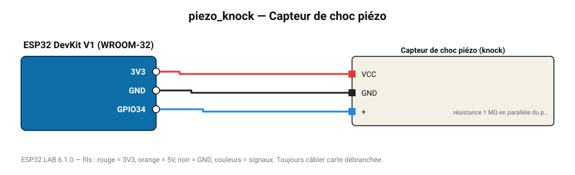

# Capteur de choc piézo

Disque piézoélectrique : détecte un toc sur une table ou une porte (serrure à code « knock »).

**Carte :** ESP32 DevKit V1 (WROOM-32) — moniteur série 115200 bauds.

| ESP32 | Composant | Broche | Couleur fil | Remarque |
|---|---|---|---|---|
| 3V3 | Capteur de choc piézo | VCC | rouge |  |
| GND | Capteur de choc piézo | GND | noir |  |
| GPIO34 | Capteur de choc piézo | + | bleu | résistance 1 MΩ en parallèle du piézo |

Toujours câbler **carte débranchée**. Masse (GND) commune entre tous les modules.
