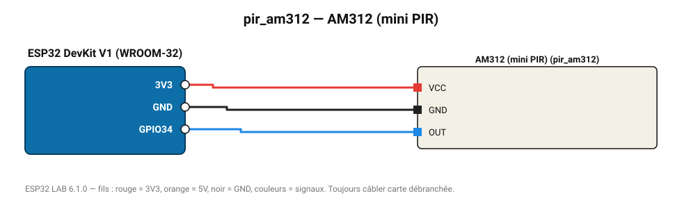

# AM312 (mini PIR)

Mini détecteur PIR 3,3 V (3-5 m, 100°), idéal sur batterie.

**Carte :** ESP32 DevKit V1 (WROOM-32) — moniteur série 115200 bauds.

| ESP32 | Composant | Broche | Couleur fil | Remarque |
|---|---|---|---|---|
| 3V3 | AM312 (mini PIR) | VCC | rouge |  |
| GND | AM312 (mini PIR) | GND | noir |  |
| GPIO34 | AM312 (mini PIR) | OUT | bleu |  |

Toujours câbler **carte débranchée**. Masse (GND) commune entre tous les modules.
