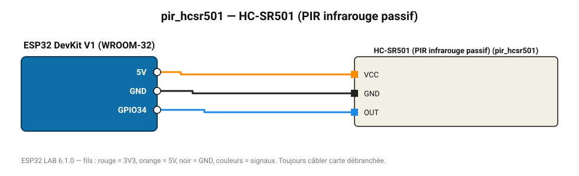

# HC-SR501 (PIR infrarouge passif)

Détecteur de mouvement pyroélectrique 7 m / 120°, temporisation et sensibilité réglables.

**Carte :** ESP32 DevKit V1 (WROOM-32) — moniteur série 115200 bauds.

| ESP32 | Composant | Broche | Couleur fil | Remarque |
|---|---|---|---|---|
| 5V (VIN) | HC-SR501 (PIR infrarouge passif) | VCC | orange |  |
| GND | HC-SR501 (PIR infrarouge passif) | GND | noir |  |
| GPIO34 | HC-SR501 (PIR infrarouge passif) | OUT | bleu |  |

Toujours câbler **carte débranchée**. Masse (GND) commune entre tous les modules.
