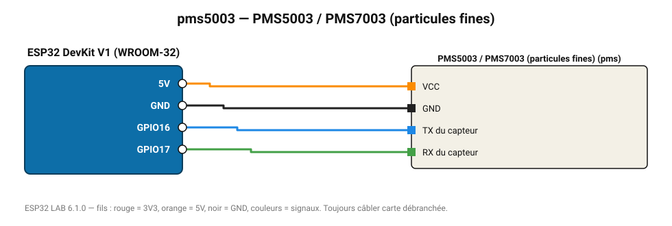

# PMS5003 / PMS7003 (particules fines)

Compteur laser de particules Plantower : PM1.0, PM2.5 et PM10 en µg/m³.

**Carte :** ESP32 DevKit V1 (WROOM-32) — moniteur série 115200 bauds.

| ESP32 | Composant | Broche | Couleur fil | Remarque |
|---|---|---|---|---|
| 5V (VIN) | PMS5003 / PMS7003 (particules fines) | VCC | orange |  |
| GND | PMS5003 / PMS7003 (particules fines) | GND | noir |  |
| GPIO16 | PMS5003 / PMS7003 (particules fines) | TX du capteur | bleu |  |
| GPIO17 | PMS5003 / PMS7003 (particules fines) | RX du capteur | vert |  |

Toujours câbler **carte débranchée**. Masse (GND) commune entre tous les modules.
