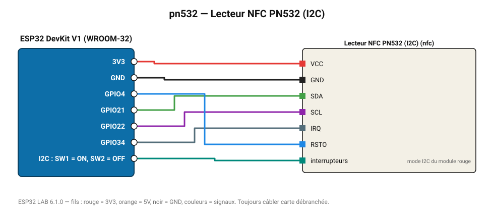

# Lecteur NFC PN532 (I2C)

Lecteur NFC polyvalent : badges MIFARE, NTAG, et même certains smartphones.

**Carte :** ESP32 DevKit V1 (WROOM-32) — moniteur série 115200 bauds.

| ESP32 | Composant | Broche | Couleur fil | Remarque |
|---|---|---|---|---|
| 3V3 | Lecteur NFC PN532 (I2C) | VCC | rouge |  |
| GND | Lecteur NFC PN532 (I2C) | GND | noir |  |
| GPIO21 | Lecteur NFC PN532 (I2C) | SDA | vert |  |
| GPIO22 | Lecteur NFC PN532 (I2C) | SCL | violet |  |
| GPIO34 | Lecteur NFC PN532 (I2C) | IRQ | gris-bleu |  |
| GPIO4 | Lecteur NFC PN532 (I2C) | RSTO | bleu |  |
| I2C : SW1 = ON, SW2 = OFF | Lecteur NFC PN532 (I2C) | interrupteurs | turquoise | mode I2C du module rouge |

Toujours câbler **carte débranchée**. Masse (GND) commune entre tous les modules.
