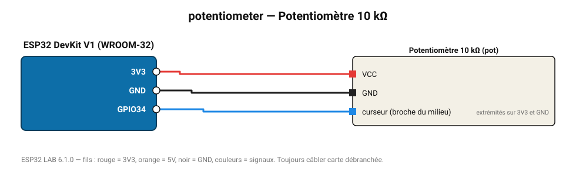

# Potentiomètre 10 kΩ

Réglage manuel : position de 0 à 100 % (curseur sur une entrée ADC).

**Carte :** ESP32 DevKit V1 (WROOM-32) — moniteur série 115200 bauds.

| ESP32 | Composant | Broche | Couleur fil | Remarque |
|---|---|---|---|---|
| 3V3 | Potentiomètre 10 kΩ | VCC | rouge |  |
| GND | Potentiomètre 10 kΩ | GND | noir |  |
| GPIO34 | Potentiomètre 10 kΩ | curseur (broche du milieu) | bleu | extrémités sur 3V3 et GND |

Toujours câbler **carte débranchée**. Masse (GND) commune entre tous les modules.
