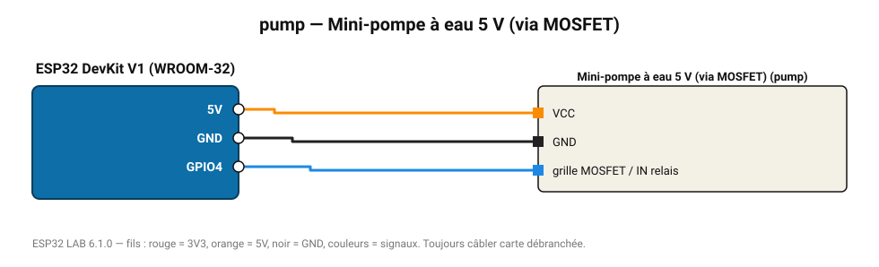

# Mini-pompe à eau 5 V (via MOSFET)

Pompe submersible pour l'arrosage automatique, avec durée maximale de sécurité.

**Carte :** ESP32 DevKit V1 (WROOM-32) — moniteur série 115200 bauds.

| ESP32 | Composant | Broche | Couleur fil | Remarque |
|---|---|---|---|---|
| 5V (VIN) | Mini-pompe à eau 5 V (via MOSFET) | VCC | orange |  |
| GND | Mini-pompe à eau 5 V (via MOSFET) | GND | noir |  |
| GPIO4 | Mini-pompe à eau 5 V (via MOSFET) | grille MOSFET / IN relais | bleu |  |

> ⚠ Consommation de pointe estimée 480 mA : prévoyez une alimentation externe 5 V (le port USB d'un PC fournit ~500 mA).
> ⚠ Alimentez Mini-pompe à eau 5 V (via MOSFET) directement en 5 V externe et reliez les masses (GND commun).

Toujours câbler **carte débranchée**. Masse (GND) commune entre tous les modules.
