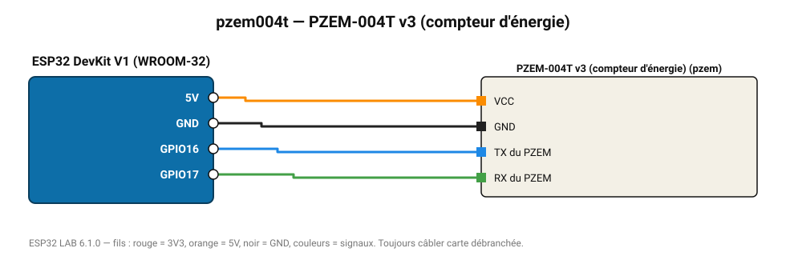

# PZEM-004T v3 (compteur d'énergie)

Compteur d'énergie monophasé : tension, courant, puissance, énergie cumulée, fréquence et facteur de puissance.

**Carte :** ESP32 DevKit V1 (WROOM-32) — moniteur série 115200 bauds.

| ESP32 | Composant | Broche | Couleur fil | Remarque |
|---|---|---|---|---|
| 5V (VIN) | PZEM-004T v3 (compteur d'énergie) | VCC | orange |  |
| GND | PZEM-004T v3 (compteur d'énergie) | GND | noir |  |
| GPIO16 | PZEM-004T v3 (compteur d'énergie) | TX du PZEM | bleu |  |
| GPIO17 | PZEM-004T v3 (compteur d'énergie) | RX du PZEM | vert |  |

Toujours câbler **carte débranchée**. Masse (GND) commune entre tous les modules.
