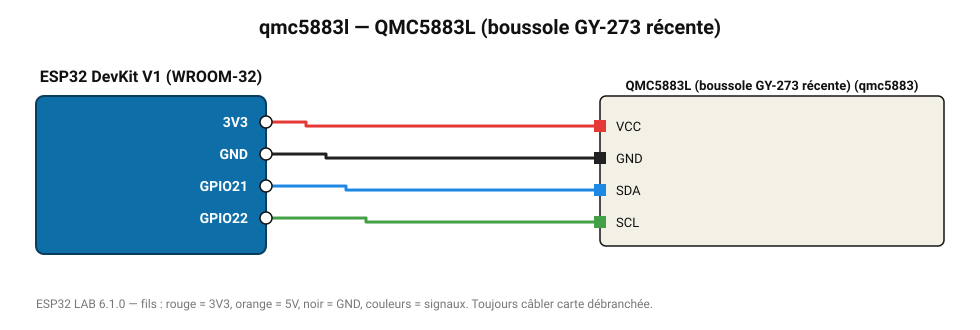

# QMC5883L (boussole GY-273 récente)

Magnétomètre 3 axes QST, piloté directement par registres.

**Carte :** ESP32 DevKit V1 (WROOM-32) — moniteur série 115200 bauds.

| ESP32 | Composant | Broche | Couleur fil | Remarque |
|---|---|---|---|---|
| 3V3 | QMC5883L (boussole GY-273 récente) | VCC | rouge |  |
| GND | QMC5883L (boussole GY-273 récente) | GND | noir |  |
| GPIO21 | QMC5883L (boussole GY-273 récente) | SDA | bleu |  |
| GPIO22 | QMC5883L (boussole GY-273 récente) | SCL | vert |  |

Toujours câbler **carte débranchée**. Masse (GND) commune entre tous les modules.
