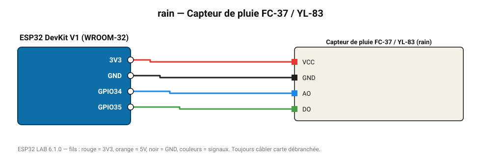

# Capteur de pluie FC-37 / YL-83

Plaque de détection de gouttes avec comparateur LM393 : intensité (AO) et seuil (DO).

**Carte :** ESP32 DevKit V1 (WROOM-32) — moniteur série 115200 bauds.

| ESP32 | Composant | Broche | Couleur fil | Remarque |
|---|---|---|---|---|
| 3V3 | Capteur de pluie FC-37 / YL-83 | VCC | rouge |  |
| GND | Capteur de pluie FC-37 / YL-83 | GND | noir |  |
| GPIO34 | Capteur de pluie FC-37 / YL-83 | AO | bleu |  |
| GPIO35 | Capteur de pluie FC-37 / YL-83 | DO | vert |  |

Toujours câbler **carte débranchée**. Masse (GND) commune entre tous les modules.
