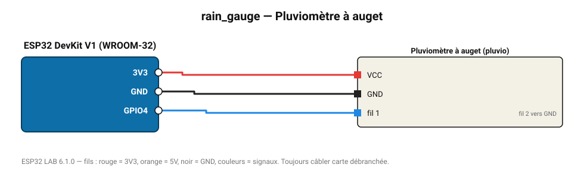

# Pluviomètre à auget

Pluviomètre basculant : 0,2794 mm de pluie par basculement.

**Carte :** ESP32 DevKit V1 (WROOM-32) — moniteur série 115200 bauds.

| ESP32 | Composant | Broche | Couleur fil | Remarque |
|---|---|---|---|---|
| 3V3 | Pluviomètre à auget | VCC | rouge |  |
| GND | Pluviomètre à auget | GND | noir |  |
| GPIO4 | Pluviomètre à auget | fil 1 | bleu | fil 2 vers GND |

Toujours câbler **carte débranchée**. Masse (GND) commune entre tous les modules.
