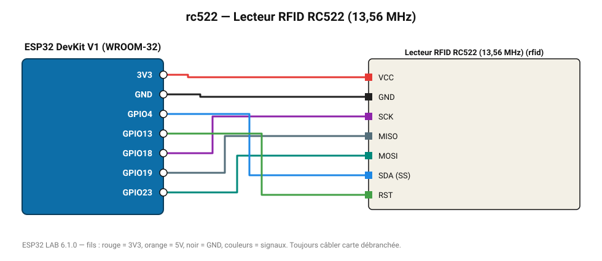

# Lecteur RFID RC522 (13,56 MHz)

Lit l'identifiant (UID) des badges et cartes MIFARE : contrôle d'accès, pointeuse.

**Carte :** ESP32 DevKit V1 (WROOM-32) — moniteur série 115200 bauds.

| ESP32 | Composant | Broche | Couleur fil | Remarque |
|---|---|---|---|---|
| 3V3 | Lecteur RFID RC522 (13,56 MHz) | VCC | rouge |  |
| GND | Lecteur RFID RC522 (13,56 MHz) | GND | noir |  |
| GPIO18 | Lecteur RFID RC522 (13,56 MHz) | SCK | violet |  |
| GPIO19 | Lecteur RFID RC522 (13,56 MHz) | MISO | gris-bleu |  |
| GPIO23 | Lecteur RFID RC522 (13,56 MHz) | MOSI | turquoise |  |
| GPIO4 | Lecteur RFID RC522 (13,56 MHz) | SDA (SS) | bleu |  |
| GPIO13 | Lecteur RFID RC522 (13,56 MHz) | RST | vert |  |

Toujours câbler **carte débranchée**. Masse (GND) commune entre tous les modules.
