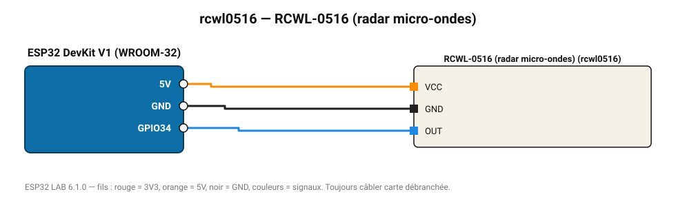

# RCWL-0516 (radar micro-ondes)

Radar Doppler 3,2 GHz : détecte les mouvements à 7 m, même à travers une paroi fine.

**Carte :** ESP32 DevKit V1 (WROOM-32) — moniteur série 115200 bauds.

| ESP32 | Composant | Broche | Couleur fil | Remarque |
|---|---|---|---|---|
| 5V (VIN) | RCWL-0516 (radar micro-ondes) | VCC | orange |  |
| GND | RCWL-0516 (radar micro-ondes) | GND | noir |  |
| GPIO34 | RCWL-0516 (radar micro-ondes) | OUT | bleu |  |

Toujours câbler **carte débranchée**. Masse (GND) commune entre tous les modules.
