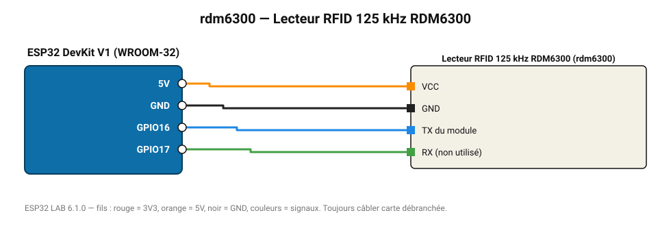

# Lecteur RFID 125 kHz RDM6300

Lit les badges 125 kHz EM4100 (portes d'immeuble) : trame ASCII à 9600 bauds.

**Carte :** ESP32 DevKit V1 (WROOM-32) — moniteur série 115200 bauds.

| ESP32 | Composant | Broche | Couleur fil | Remarque |
|---|---|---|---|---|
| 5V (VIN) | Lecteur RFID 125 kHz RDM6300 | VCC | orange |  |
| GND | Lecteur RFID 125 kHz RDM6300 | GND | noir |  |
| GPIO16 | Lecteur RFID 125 kHz RDM6300 | TX du module | bleu |  |
| GPIO17 | Lecteur RFID 125 kHz RDM6300 | RX (non utilisé) | vert |  |

Toujours câbler **carte débranchée**. Masse (GND) commune entre tous les modules.
