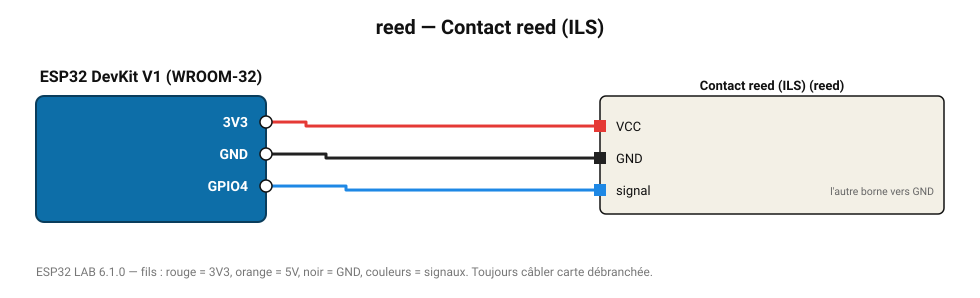

# Contact reed (ILS)

Interrupteur à lame souple : ouverture de porte/fenêtre, compteur à aimant.

**Carte :** ESP32 DevKit V1 (WROOM-32) — moniteur série 115200 bauds.

| ESP32 | Composant | Broche | Couleur fil | Remarque |
|---|---|---|---|---|
| 3V3 | Contact reed (ILS) | VCC | rouge |  |
| GND | Contact reed (ILS) | GND | noir |  |
| GPIO4 | Contact reed (ILS) | signal | bleu | l'autre borne vers GND |

Toujours câbler **carte débranchée**. Masse (GND) commune entre tous les modules.
