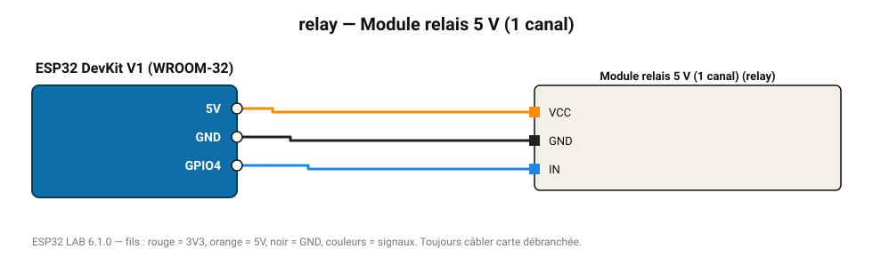

# Module relais 5 V (1 canal)

Relais électromécanique 10 A / 250 V : lampe, pompe, chauffage (via optocoupleur).

**Carte :** ESP32 DevKit V1 (WROOM-32) — moniteur série 115200 bauds.

| ESP32 | Composant | Broche | Couleur fil | Remarque |
|---|---|---|---|---|
| 5V (VIN) | Module relais 5 V (1 canal) | VCC | orange |  |
| GND | Module relais 5 V (1 canal) | GND | noir |  |
| GPIO4 | Module relais 5 V (1 canal) | IN | bleu |  |

Toujours câbler **carte débranchée**. Masse (GND) commune entre tous les modules.
