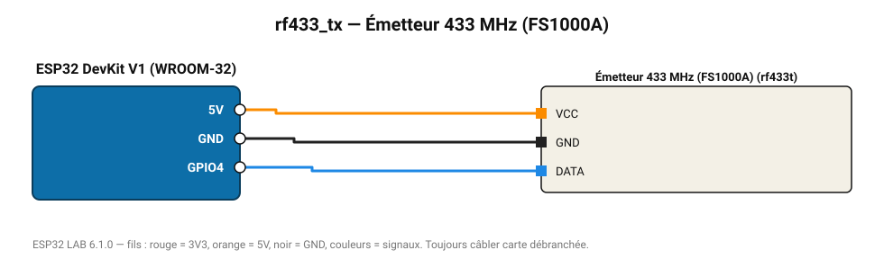

# Émetteur 433 MHz (FS1000A)

Pilote des prises radiocommandées 433 MHz (codes relevés avec le récepteur).

**Carte :** ESP32 DevKit V1 (WROOM-32) — moniteur série 115200 bauds.

| ESP32 | Composant | Broche | Couleur fil | Remarque |
|---|---|---|---|---|
| 5V (VIN) | Émetteur 433 MHz (FS1000A) | VCC | orange |  |
| GND | Émetteur 433 MHz (FS1000A) | GND | noir |  |
| GPIO4 | Émetteur 433 MHz (FS1000A) | DATA | bleu |  |

Toujours câbler **carte débranchée**. Masse (GND) commune entre tous les modules.
