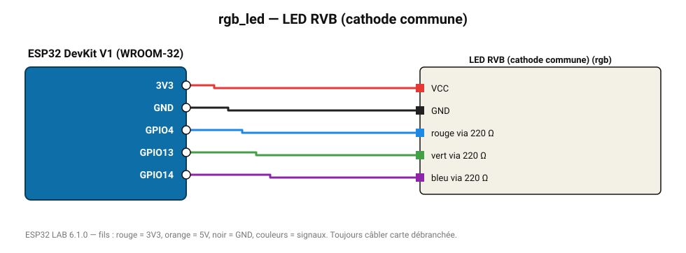

# LED RVB (cathode commune)

LED tricolore pilotée en PWM : toutes les couleurs par mélange rouge/vert/bleu.

**Carte :** ESP32 DevKit V1 (WROOM-32) — moniteur série 115200 bauds.

| ESP32 | Composant | Broche | Couleur fil | Remarque |
|---|---|---|---|---|
| 3V3 | LED RVB (cathode commune) | VCC | rouge |  |
| GND | LED RVB (cathode commune) | GND | noir |  |
| GPIO4 | LED RVB (cathode commune) | rouge via 220 Ω | bleu |  |
| GPIO13 | LED RVB (cathode commune) | vert via 220 Ω | vert |  |
| GPIO14 | LED RVB (cathode commune) | bleu via 220 Ω | violet |  |

Toujours câbler **carte débranchée**. Masse (GND) commune entre tous les modules.
