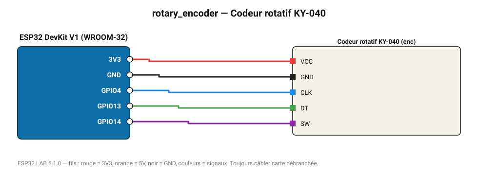

# Codeur rotatif KY-040

Bouton rotatif à 20 crans avec poussoir : lecture par interruptions en quadrature.

**Carte :** ESP32 DevKit V1 (WROOM-32) — moniteur série 115200 bauds.

| ESP32 | Composant | Broche | Couleur fil | Remarque |
|---|---|---|---|---|
| 3V3 | Codeur rotatif KY-040 | VCC | rouge |  |
| GND | Codeur rotatif KY-040 | GND | noir |  |
| GPIO4 | Codeur rotatif KY-040 | CLK | bleu |  |
| GPIO13 | Codeur rotatif KY-040 | DT | vert |  |
| GPIO14 | Codeur rotatif KY-040 | SW | violet |  |

Toujours câbler **carte débranchée**. Masse (GND) commune entre tous les modules.
