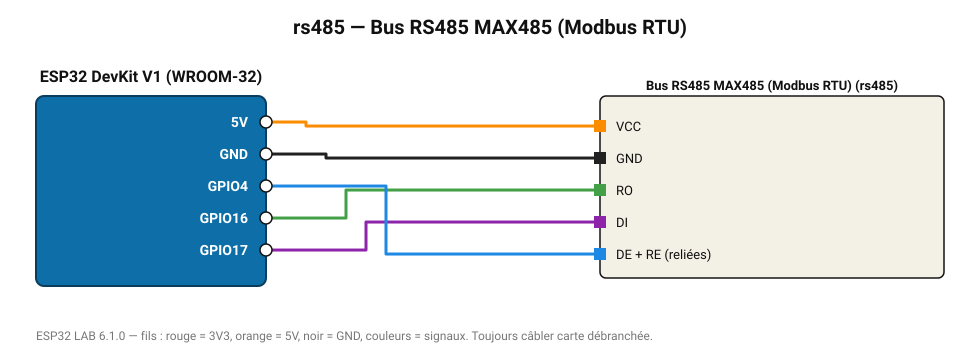

# Bus RS485 MAX485 (Modbus RTU)

Interroge un appareil Modbus RTU (compteur, variateur, sonde) : lecture de registres.

**Carte :** ESP32 DevKit V1 (WROOM-32) — moniteur série 115200 bauds.

| ESP32 | Composant | Broche | Couleur fil | Remarque |
|---|---|---|---|---|
| 5V (VIN) | Bus RS485 MAX485 (Modbus RTU) | VCC | orange |  |
| GND | Bus RS485 MAX485 (Modbus RTU) | GND | noir |  |
| GPIO16 | Bus RS485 MAX485 (Modbus RTU) | RO | vert |  |
| GPIO17 | Bus RS485 MAX485 (Modbus RTU) | DI | violet |  |
| GPIO4 | Bus RS485 MAX485 (Modbus RTU) | DE + RE (reliées) | bleu |  |

Toujours câbler **carte débranchée**. Masse (GND) commune entre tous les modules.
