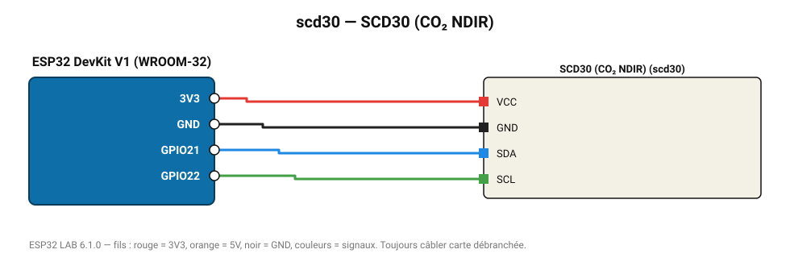

# SCD30 (CO₂ NDIR)

Vrai capteur CO₂ infrarouge Sensirion (400-10 000 ppm) + température et humidité.

**Carte :** ESP32 DevKit V1 (WROOM-32) — moniteur série 115200 bauds.

| ESP32 | Composant | Broche | Couleur fil | Remarque |
|---|---|---|---|---|
| 3V3 | SCD30 (CO₂ NDIR) | VCC | rouge |  |
| GND | SCD30 (CO₂ NDIR) | GND | noir |  |
| GPIO21 | SCD30 (CO₂ NDIR) | SDA | bleu |  |
| GPIO22 | SCD30 (CO₂ NDIR) | SCL | vert |  |

Toujours câbler **carte débranchée**. Masse (GND) commune entre tous les modules.
