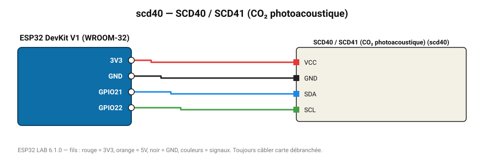

# SCD40 / SCD41 (CO₂ photoacoustique)

Capteur CO₂ miniature Sensirion (400-5000 ppm), piloté directement par commandes I2C.

**Carte :** ESP32 DevKit V1 (WROOM-32) — moniteur série 115200 bauds.

| ESP32 | Composant | Broche | Couleur fil | Remarque |
|---|---|---|---|---|
| 3V3 | SCD40 / SCD41 (CO₂ photoacoustique) | VCC | rouge |  |
| GND | SCD40 / SCD41 (CO₂ photoacoustique) | GND | noir |  |
| GPIO21 | SCD40 / SCD41 (CO₂ photoacoustique) | SDA | bleu |  |
| GPIO22 | SCD40 / SCD41 (CO₂ photoacoustique) | SCL | vert |  |

Toujours câbler **carte débranchée**. Masse (GND) commune entre tous les modules.
