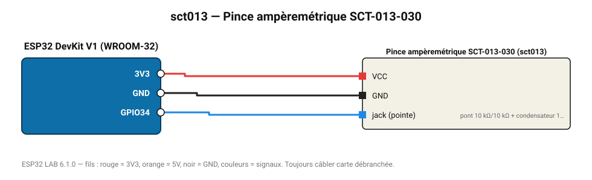

# Pince ampèremétrique SCT-013-030

Mesure non invasive du courant alternatif (30 A → 1 V) autour d'un seul conducteur.

**Carte :** ESP32 DevKit V1 (WROOM-32) — moniteur série 115200 bauds.

| ESP32 | Composant | Broche | Couleur fil | Remarque |
|---|---|---|---|---|
| 3V3 | Pince ampèremétrique SCT-013-030 | VCC | rouge |  |
| GND | Pince ampèremétrique SCT-013-030 | GND | noir |  |
| GPIO34 | Pince ampèremétrique SCT-013-030 | jack (pointe) | bleu | pont 10 kΩ/10 kΩ + condensateur 10 µF pour centrer à 1,65 V |

Toujours câbler **carte débranchée**. Masse (GND) commune entre tous les modules.
