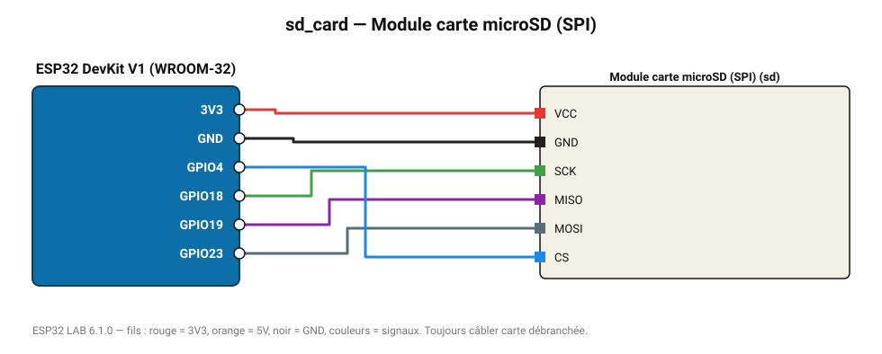

# Module carte microSD (SPI)

Enregistreur de données : écrit toutes les mesures du projet dans un fichier CSV (Excel/LibreOffice).

**Carte :** ESP32 DevKit V1 (WROOM-32) — moniteur série 115200 bauds.

| ESP32 | Composant | Broche | Couleur fil | Remarque |
|---|---|---|---|---|
| 3V3 | Module carte microSD (SPI) | VCC | rouge |  |
| GND | Module carte microSD (SPI) | GND | noir |  |
| GPIO18 | Module carte microSD (SPI) | SCK | vert |  |
| GPIO19 | Module carte microSD (SPI) | MISO | violet |  |
| GPIO23 | Module carte microSD (SPI) | MOSI | gris-bleu |  |
| GPIO4 | Module carte microSD (SPI) | CS | bleu |  |

Toujours câbler **carte débranchée**. Masse (GND) commune entre tous les modules.
