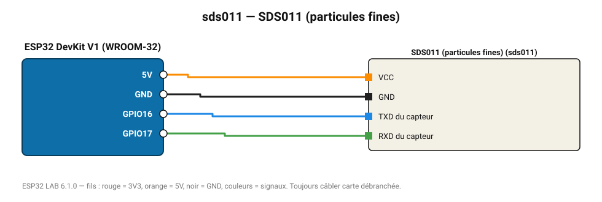

# SDS011 (particules fines)

Capteur laser Nova Fitness : PM2.5 et PM10, utilisé par le réseau citoyen Sensor.Community.

**Carte :** ESP32 DevKit V1 (WROOM-32) — moniteur série 115200 bauds.

| ESP32 | Composant | Broche | Couleur fil | Remarque |
|---|---|---|---|---|
| 5V (VIN) | SDS011 (particules fines) | VCC | orange |  |
| GND | SDS011 (particules fines) | GND | noir |  |
| GPIO16 | SDS011 (particules fines) | TXD du capteur | bleu |  |
| GPIO17 | SDS011 (particules fines) | RXD du capteur | vert |  |

Toujours câbler **carte débranchée**. Masse (GND) commune entre tous les modules.
