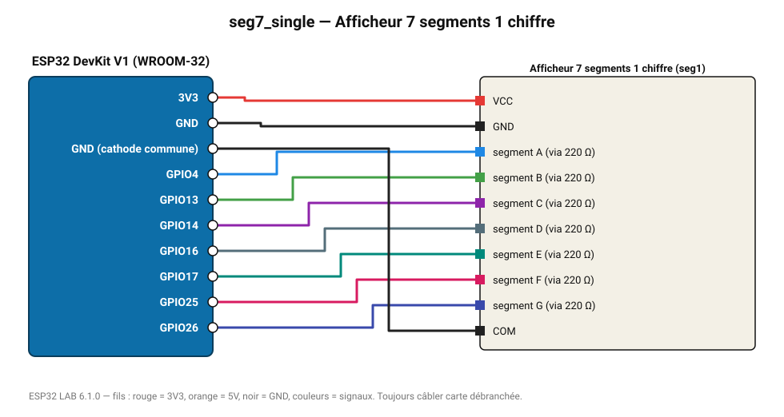

# Afficheur 7 segments 1 chiffre

Afficheur à cathode commune piloté directement par 7 GPIO : compteur 0-9.

**Carte :** ESP32 DevKit V1 (WROOM-32) — moniteur série 115200 bauds.

| ESP32 | Composant | Broche | Couleur fil | Remarque |
|---|---|---|---|---|
| 3V3 | Afficheur 7 segments 1 chiffre | VCC | rouge |  |
| GND | Afficheur 7 segments 1 chiffre | GND | noir |  |
| GPIO4 | Afficheur 7 segments 1 chiffre | segment A (via 220 Ω) | bleu |  |
| GPIO13 | Afficheur 7 segments 1 chiffre | segment B (via 220 Ω) | vert |  |
| GPIO14 | Afficheur 7 segments 1 chiffre | segment C (via 220 Ω) | violet |  |
| GPIO16 | Afficheur 7 segments 1 chiffre | segment D (via 220 Ω) | gris-bleu |  |
| GPIO17 | Afficheur 7 segments 1 chiffre | segment E (via 220 Ω) | turquoise |  |
| GPIO25 | Afficheur 7 segments 1 chiffre | segment F (via 220 Ω) | rose |  |
| GPIO26 | Afficheur 7 segments 1 chiffre | segment G (via 220 Ω) | indigo |  |
| GND (cathode commune) | Afficheur 7 segments 1 chiffre | COM | noir |  |

Toujours câbler **carte débranchée**. Masse (GND) commune entre tous les modules.
