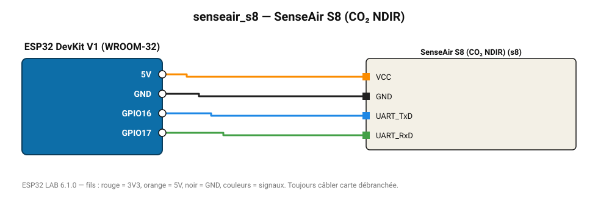

# SenseAir S8 (CO₂ NDIR)

Capteur CO₂ industriel 400-2000 ppm (±40 ppm), protocole Modbus RTU.

**Carte :** ESP32 DevKit V1 (WROOM-32) — moniteur série 115200 bauds.

| ESP32 | Composant | Broche | Couleur fil | Remarque |
|---|---|---|---|---|
| 5V (VIN) | SenseAir S8 (CO₂ NDIR) | VCC | orange |  |
| GND | SenseAir S8 (CO₂ NDIR) | GND | noir |  |
| GPIO16 | SenseAir S8 (CO₂ NDIR) | UART_TxD | bleu |  |
| GPIO17 | SenseAir S8 (CO₂ NDIR) | UART_RxD | vert |  |

> ⚠ Alimentez SenseAir S8 (CO₂ NDIR) directement en 5 V externe et reliez les masses (GND commun).

Toujours câbler **carte débranchée**. Masse (GND) commune entre tous les modules.
