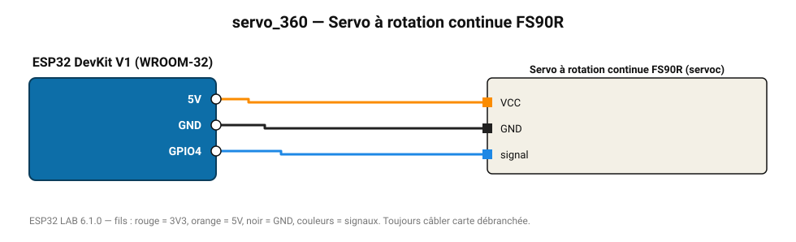

# Servo à rotation continue FS90R

Servo modifié en motoréducteur : vitesse et sens de rotation (90 = arrêt).

**Carte :** ESP32 DevKit V1 (WROOM-32) — moniteur série 115200 bauds.

| ESP32 | Composant | Broche | Couleur fil | Remarque |
|---|---|---|---|---|
| 5V (VIN) | Servo à rotation continue FS90R | VCC | orange |  |
| GND | Servo à rotation continue FS90R | GND | noir |  |
| GPIO4 | Servo à rotation continue FS90R | signal | bleu |  |

> ⚠ Consommation de pointe estimée 780 mA : prévoyez une alimentation externe 5 V (le port USB d'un PC fournit ~500 mA).
> ⚠ Alimentez Servo à rotation continue FS90R directement en 5 V externe et reliez les masses (GND commun).

Toujours câbler **carte débranchée**. Masse (GND) commune entre tous les modules.
