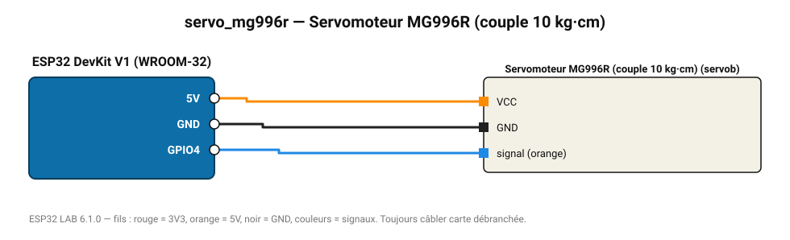

# Servomoteur MG996R (couple 10 kg·cm)

Servo à pignons métal pour bras robotisés et mécanismes lourds.

**Carte :** ESP32 DevKit V1 (WROOM-32) — moniteur série 115200 bauds.

| ESP32 | Composant | Broche | Couleur fil | Remarque |
|---|---|---|---|---|
| 5V (VIN) | Servomoteur MG996R (couple 10 kg·cm) | VCC | orange |  |
| GND | Servomoteur MG996R (couple 10 kg·cm) | GND | noir |  |
| GPIO4 | Servomoteur MG996R (couple 10 kg·cm) | signal (orange) | bleu |  |

> ⚠ Consommation de pointe estimée 2580 mA : prévoyez une alimentation externe 5 V (le port USB d'un PC fournit ~500 mA).
> ⚠ Alimentez Servomoteur MG996R (couple 10 kg·cm) directement en 5 V externe et reliez les masses (GND commun).

Toujours câbler **carte débranchée**. Masse (GND) commune entre tous les modules.
