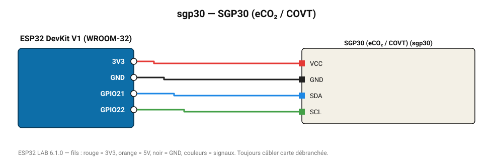

# SGP30 (eCO₂ / COVT)

Capteur multi-pixels Sensirion : COV totaux et CO₂ équivalent, mesure chaque seconde.

**Carte :** ESP32 DevKit V1 (WROOM-32) — moniteur série 115200 bauds.

| ESP32 | Composant | Broche | Couleur fil | Remarque |
|---|---|---|---|---|
| 3V3 | SGP30 (eCO₂ / COVT) | VCC | rouge |  |
| GND | SGP30 (eCO₂ / COVT) | GND | noir |  |
| GPIO21 | SGP30 (eCO₂ / COVT) | SDA | bleu |  |
| GPIO22 | SGP30 (eCO₂ / COVT) | SCL | vert |  |

Toujours câbler **carte débranchée**. Masse (GND) commune entre tous les modules.
