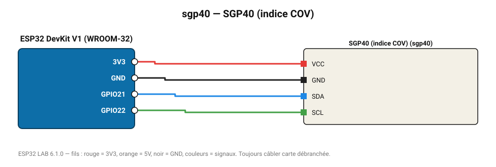

# SGP40 (indice COV)

Indice COV Sensirion de 0 à 500 (100 = moyenne des dernières 24 h).

**Carte :** ESP32 DevKit V1 (WROOM-32) — moniteur série 115200 bauds.

| ESP32 | Composant | Broche | Couleur fil | Remarque |
|---|---|---|---|---|
| 3V3 | SGP40 (indice COV) | VCC | rouge |  |
| GND | SGP40 (indice COV) | GND | noir |  |
| GPIO21 | SGP40 (indice COV) | SDA | bleu |  |
| GPIO22 | SGP40 (indice COV) | SCL | vert |  |

Toujours câbler **carte débranchée**. Masse (GND) commune entre tous les modules.
