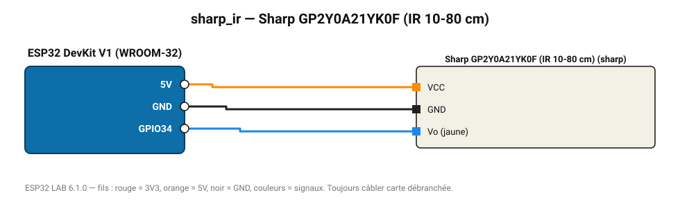

# Sharp GP2Y0A21YK0F (IR 10-80 cm)

Télémètre infrarouge analogique par triangulation, sortie non linéaire 0,4-3,1 V.

**Carte :** ESP32 DevKit V1 (WROOM-32) — moniteur série 115200 bauds.

| ESP32 | Composant | Broche | Couleur fil | Remarque |
|---|---|---|---|---|
| 5V (VIN) | Sharp GP2Y0A21YK0F (IR 10-80 cm) | VCC | orange |  |
| GND | Sharp GP2Y0A21YK0F (IR 10-80 cm) | GND | noir |  |
| GPIO34 | Sharp GP2Y0A21YK0F (IR 10-80 cm) | Vo (jaune) | bleu |  |

Toujours câbler **carte débranchée**. Masse (GND) commune entre tous les modules.
