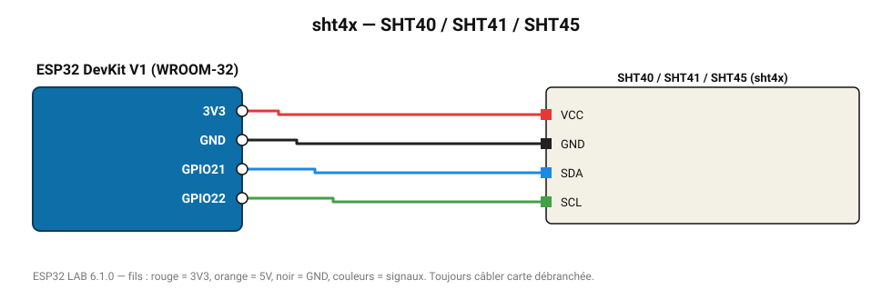

# SHT40 / SHT41 / SHT45

Génération 4 Sensirion : ±0,2 °C, ±1,8 % HR, très faible consommation.

**Carte :** ESP32 DevKit V1 (WROOM-32) — moniteur série 115200 bauds.

| ESP32 | Composant | Broche | Couleur fil | Remarque |
|---|---|---|---|---|
| 3V3 | SHT40 / SHT41 / SHT45 | VCC | rouge |  |
| GND | SHT40 / SHT41 / SHT45 | GND | noir |  |
| GPIO21 | SHT40 / SHT41 / SHT45 | SDA | bleu |  |
| GPIO22 | SHT40 / SHT41 / SHT45 | SCL | vert |  |

Toujours câbler **carte débranchée**. Masse (GND) commune entre tous les modules.
