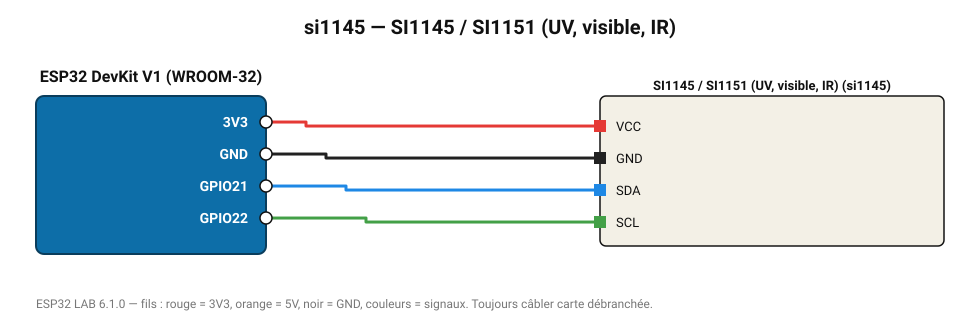

# SI1145 / SI1151 (UV, visible, IR)

Capteur Silicon Labs : indice UV calculé, lumière visible et infrarouge.

**Carte :** ESP32 DevKit V1 (WROOM-32) — moniteur série 115200 bauds.

| ESP32 | Composant | Broche | Couleur fil | Remarque |
|---|---|---|---|---|
| 3V3 | SI1145 / SI1151 (UV, visible, IR) | VCC | rouge |  |
| GND | SI1145 / SI1151 (UV, visible, IR) | GND | noir |  |
| GPIO21 | SI1145 / SI1151 (UV, visible, IR) | SDA | bleu |  |
| GPIO22 | SI1145 / SI1151 (UV, visible, IR) | SCL | vert |  |

Toujours câbler **carte débranchée**. Masse (GND) commune entre tous les modules.
