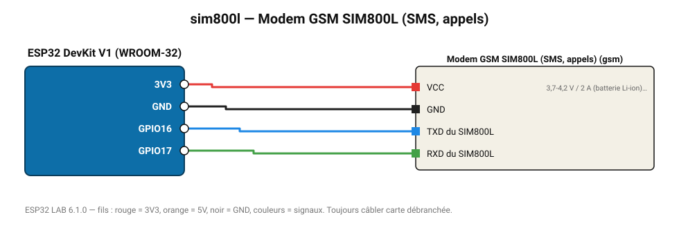

# Modem GSM SIM800L (SMS, appels)

Modem 2G : envoie des SMS d'alerte, mesure la qualité du réseau (commandes AT).

**Carte :** ESP32 DevKit V1 (WROOM-32) — moniteur série 115200 bauds.

| ESP32 | Composant | Broche | Couleur fil | Remarque |
|---|---|---|---|---|
| 3V3 | Modem GSM SIM800L (SMS, appels) | VCC | rouge | 3,7-4,2 V / 2 A (batterie Li-ion), PAS le 3V3 de l'ESP32 |
| GND | Modem GSM SIM800L (SMS, appels) | GND | noir |  |
| GPIO16 | Modem GSM SIM800L (SMS, appels) | TXD du SIM800L | bleu |  |
| GPIO17 | Modem GSM SIM800L (SMS, appels) | RXD du SIM800L | vert |  |

> ⚠ Consommation de pointe estimée 2080 mA : prévoyez une alimentation externe 5 V (le port USB d'un PC fournit ~500 mA).

Toujours câbler **carte débranchée**. Masse (GND) commune entre tous les modules.
