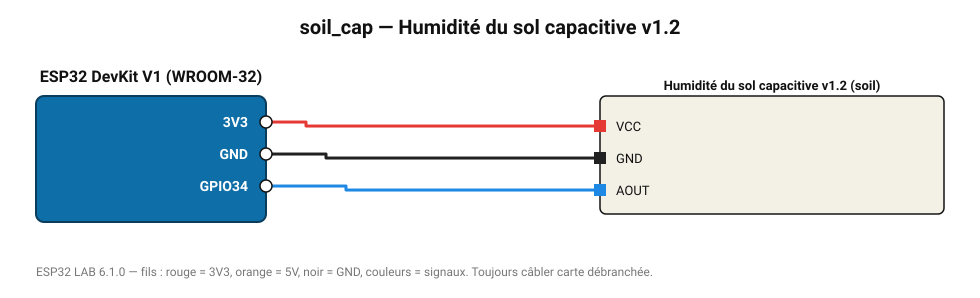

# Humidité du sol capacitive v1.2

Sonde capacitive sans électrode exposée : ne se corrode pas, idéale pour l'arrosage automatique.

**Carte :** ESP32 DevKit V1 (WROOM-32) — moniteur série 115200 bauds.

| ESP32 | Composant | Broche | Couleur fil | Remarque |
|---|---|---|---|---|
| 3V3 | Humidité du sol capacitive v1.2 | VCC | rouge |  |
| GND | Humidité du sol capacitive v1.2 | GND | noir |  |
| GPIO34 | Humidité du sol capacitive v1.2 | AOUT | bleu |  |

Toujours câbler **carte débranchée**. Masse (GND) commune entre tous les modules.
