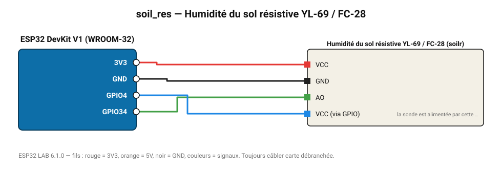

# Humidité du sol résistive YL-69 / FC-28

Fourche résistive économique ; alimentée seulement pendant la mesure pour limiter la corrosion.

**Carte :** ESP32 DevKit V1 (WROOM-32) — moniteur série 115200 bauds.

| ESP32 | Composant | Broche | Couleur fil | Remarque |
|---|---|---|---|---|
| 3V3 | Humidité du sol résistive YL-69 / FC-28 | VCC | rouge |  |
| GND | Humidité du sol résistive YL-69 / FC-28 | GND | noir |  |
| GPIO34 | Humidité du sol résistive YL-69 / FC-28 | AO | vert |  |
| GPIO4 | Humidité du sol résistive YL-69 / FC-28 | VCC (via GPIO) | bleu | la sonde est alimentée par cette broche |

Toujours câbler **carte débranchée**. Masse (GND) commune entre tous les modules.
