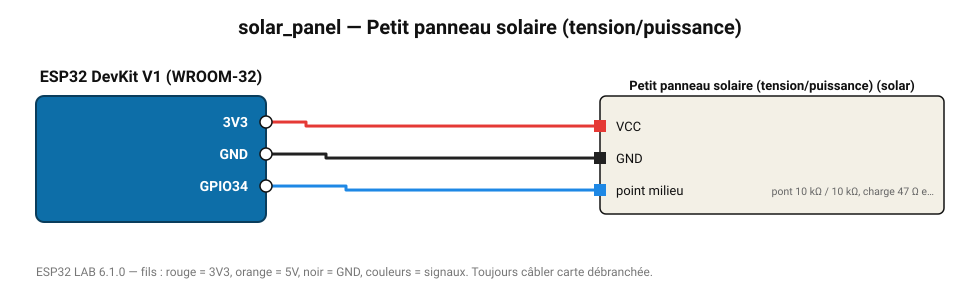

# Petit panneau solaire (tension/puissance)

Mesure la tension d'un panneau 6 V sur charge résistive pour estimer l'ensoleillement.

**Carte :** ESP32 DevKit V1 (WROOM-32) — moniteur série 115200 bauds.

| ESP32 | Composant | Broche | Couleur fil | Remarque |
|---|---|---|---|---|
| 3V3 | Petit panneau solaire (tension/puissance) | VCC | rouge |  |
| GND | Petit panneau solaire (tension/puissance) | GND | noir |  |
| GPIO34 | Petit panneau solaire (tension/puissance) | point milieu | bleu | pont 10 kΩ / 10 kΩ, charge 47 Ω en parallèle du panneau |

Toujours câbler **carte débranchée**. Masse (GND) commune entre tous les modules.
