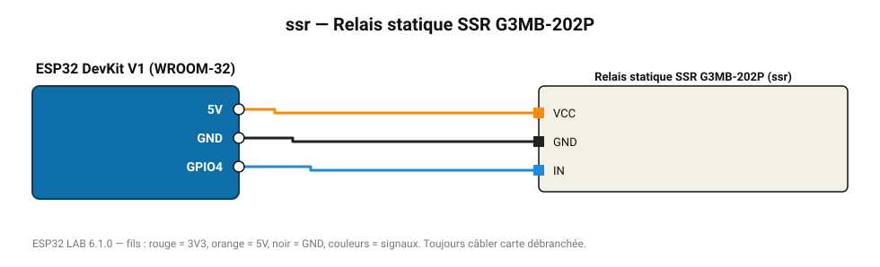

# Relais statique SSR G3MB-202P

Relais statique silencieux 2 A / 240 V AC, commutation au passage à zéro (charges résistives).

**Carte :** ESP32 DevKit V1 (WROOM-32) — moniteur série 115200 bauds.

| ESP32 | Composant | Broche | Couleur fil | Remarque |
|---|---|---|---|---|
| 5V (VIN) | Relais statique SSR G3MB-202P | VCC | orange |  |
| GND | Relais statique SSR G3MB-202P | GND | noir |  |
| GPIO4 | Relais statique SSR G3MB-202P | IN | bleu |  |

Toujours câbler **carte débranchée**. Masse (GND) commune entre tous les modules.
