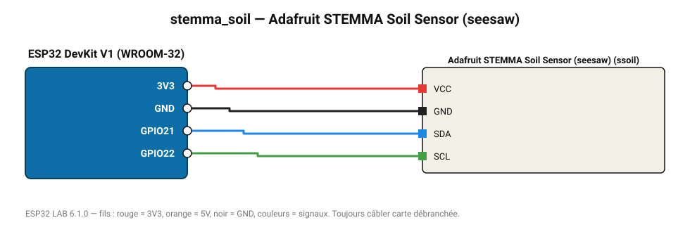

# Adafruit STEMMA Soil Sensor (seesaw)

Sonde capacitive I2C : humidité du sol et température, sans ADC.

**Carte :** ESP32 DevKit V1 (WROOM-32) — moniteur série 115200 bauds.

| ESP32 | Composant | Broche | Couleur fil | Remarque |
|---|---|---|---|---|
| 3V3 | Adafruit STEMMA Soil Sensor (seesaw) | VCC | rouge |  |
| GND | Adafruit STEMMA Soil Sensor (seesaw) | GND | noir |  |
| GPIO21 | Adafruit STEMMA Soil Sensor (seesaw) | SDA | bleu |  |
| GPIO22 | Adafruit STEMMA Soil Sensor (seesaw) | SCL | vert |  |

Toujours câbler **carte débranchée**. Masse (GND) commune entre tous les modules.
