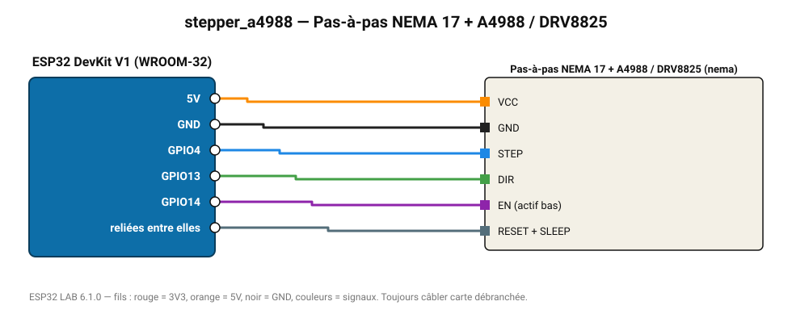

# Pas-à-pas NEMA 17 + A4988 / DRV8825

Moteur 200 pas/tour avec driver STEP/DIR : imprimante 3D, CNC, axe linéaire.

**Carte :** ESP32 DevKit V1 (WROOM-32) — moniteur série 115200 bauds.

| ESP32 | Composant | Broche | Couleur fil | Remarque |
|---|---|---|---|---|
| 5V (VIN) | Pas-à-pas NEMA 17 + A4988 / DRV8825 | VCC | orange |  |
| GND | Pas-à-pas NEMA 17 + A4988 / DRV8825 | GND | noir |  |
| GPIO4 | Pas-à-pas NEMA 17 + A4988 / DRV8825 | STEP | bleu |  |
| GPIO13 | Pas-à-pas NEMA 17 + A4988 / DRV8825 | DIR | vert |  |
| GPIO14 | Pas-à-pas NEMA 17 + A4988 / DRV8825 | EN (actif bas) | violet |  |
| reliées entre elles | Pas-à-pas NEMA 17 + A4988 / DRV8825 | RESET + SLEEP | gris-bleu |  |

Toujours câbler **carte débranchée**. Masse (GND) commune entre tous les modules.
