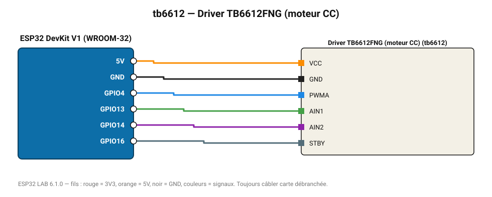

# Driver TB6612FNG (moteur CC)

Driver MOSFET efficace 1,2 A par voie, idéal pour petits robots.

**Carte :** ESP32 DevKit V1 (WROOM-32) — moniteur série 115200 bauds.

| ESP32 | Composant | Broche | Couleur fil | Remarque |
|---|---|---|---|---|
| 5V (VIN) | Driver TB6612FNG (moteur CC) | VCC | orange |  |
| GND | Driver TB6612FNG (moteur CC) | GND | noir |  |
| GPIO4 | Driver TB6612FNG (moteur CC) | PWMA | bleu |  |
| GPIO13 | Driver TB6612FNG (moteur CC) | AIN1 | vert |  |
| GPIO14 | Driver TB6612FNG (moteur CC) | AIN2 | violet |  |
| GPIO16 | Driver TB6612FNG (moteur CC) | STBY | gris-bleu |  |

> ⚠ Consommation de pointe estimée 1580 mA : prévoyez une alimentation externe 5 V (le port USB d'un PC fournit ~500 mA).
> ⚠ Alimentez Driver TB6612FNG (moteur CC) directement en 5 V externe et reliez les masses (GND commun).

Toujours câbler **carte débranchée**. Masse (GND) commune entre tous les modules.
