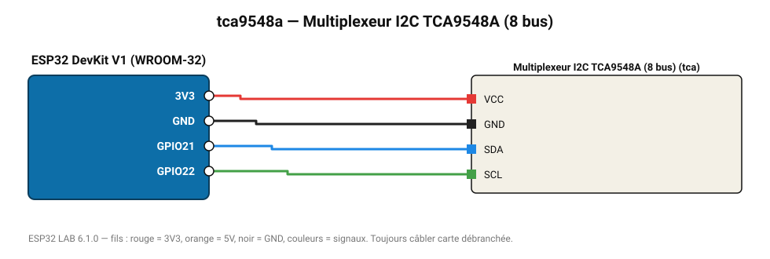

# Multiplexeur I2C TCA9548A (8 bus)

Permet de brancher plusieurs capteurs ayant la même adresse I2C : scanne ses 8 sous-bus.

**Carte :** ESP32 DevKit V1 (WROOM-32) — moniteur série 115200 bauds.

| ESP32 | Composant | Broche | Couleur fil | Remarque |
|---|---|---|---|---|
| 3V3 | Multiplexeur I2C TCA9548A (8 bus) | VCC | rouge |  |
| GND | Multiplexeur I2C TCA9548A (8 bus) | GND | noir |  |
| GPIO21 | Multiplexeur I2C TCA9548A (8 bus) | SDA | bleu |  |
| GPIO22 | Multiplexeur I2C TCA9548A (8 bus) | SCL | vert |  |

Toujours câbler **carte débranchée**. Masse (GND) commune entre tous les modules.
