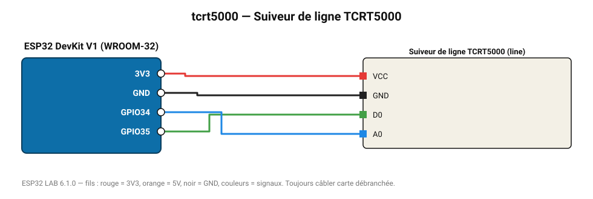

# Suiveur de ligne TCRT5000

Capteur réflectif pour robot suiveur de ligne : distingue une ligne noire d'un sol clair.

**Carte :** ESP32 DevKit V1 (WROOM-32) — moniteur série 115200 bauds.

| ESP32 | Composant | Broche | Couleur fil | Remarque |
|---|---|---|---|---|
| 3V3 | Suiveur de ligne TCRT5000 | VCC | rouge |  |
| GND | Suiveur de ligne TCRT5000 | GND | noir |  |
| GPIO35 | Suiveur de ligne TCRT5000 | D0 | vert |  |
| GPIO34 | Suiveur de ligne TCRT5000 | A0 | bleu |  |

Toujours câbler **carte débranchée**. Masse (GND) commune entre tous les modules.
