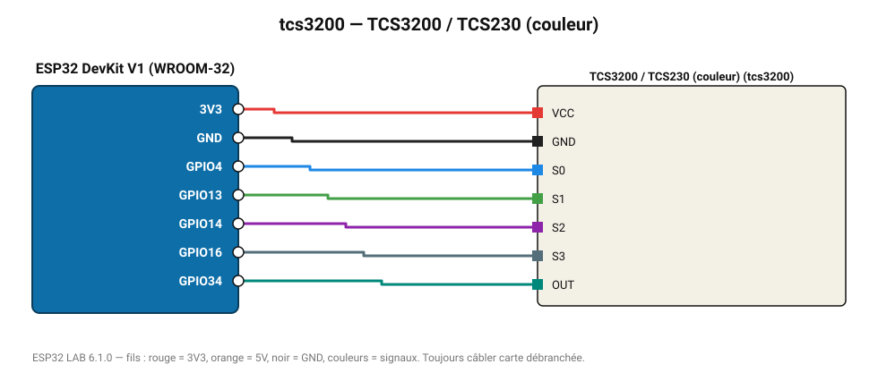

# TCS3200 / TCS230 (couleur)

Capteur de couleur à sortie en fréquence : filtres sélectionnés par S2/S3, échelle par S0/S1.

**Carte :** ESP32 DevKit V1 (WROOM-32) — moniteur série 115200 bauds.

| ESP32 | Composant | Broche | Couleur fil | Remarque |
|---|---|---|---|---|
| 3V3 | TCS3200 / TCS230 (couleur) | VCC | rouge |  |
| GND | TCS3200 / TCS230 (couleur) | GND | noir |  |
| GPIO4 | TCS3200 / TCS230 (couleur) | S0 | bleu |  |
| GPIO13 | TCS3200 / TCS230 (couleur) | S1 | vert |  |
| GPIO14 | TCS3200 / TCS230 (couleur) | S2 | violet |  |
| GPIO16 | TCS3200 / TCS230 (couleur) | S3 | gris-bleu |  |
| GPIO34 | TCS3200 / TCS230 (couleur) | OUT | turquoise |  |

Toujours câbler **carte débranchée**. Masse (GND) commune entre tous les modules.
