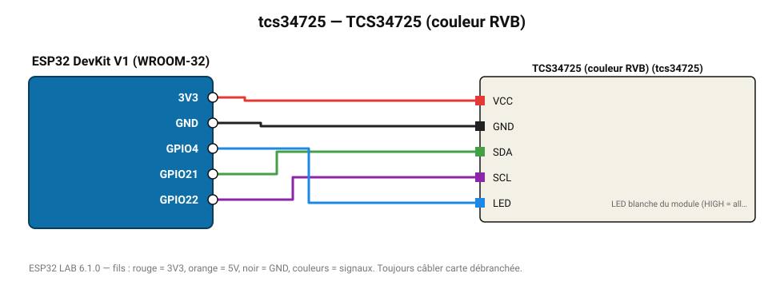

# TCS34725 (couleur RVB)

Capteur de couleur avec filtre IR et LED blanche : composantes R, V, B, température de couleur et lux.

**Carte :** ESP32 DevKit V1 (WROOM-32) — moniteur série 115200 bauds.

| ESP32 | Composant | Broche | Couleur fil | Remarque |
|---|---|---|---|---|
| 3V3 | TCS34725 (couleur RVB) | VCC | rouge |  |
| GND | TCS34725 (couleur RVB) | GND | noir |  |
| GPIO21 | TCS34725 (couleur RVB) | SDA | vert |  |
| GPIO22 | TCS34725 (couleur RVB) | SCL | violet |  |
| GPIO4 | TCS34725 (couleur RVB) | LED | bleu | LED blanche du module (HIGH = allumée) |

Toujours câbler **carte débranchée**. Masse (GND) commune entre tous les modules.
