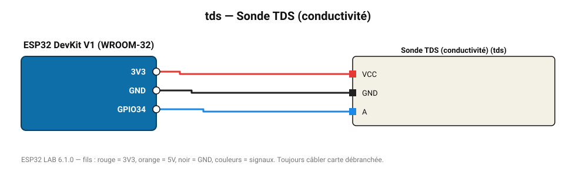

# Sonde TDS (conductivité)

Total des solides dissous en ppm (qualité de l'eau potable, hydroponie).

**Carte :** ESP32 DevKit V1 (WROOM-32) — moniteur série 115200 bauds.

| ESP32 | Composant | Broche | Couleur fil | Remarque |
|---|---|---|---|---|
| 3V3 | Sonde TDS (conductivité) | VCC | rouge |  |
| GND | Sonde TDS (conductivité) | GND | noir |  |
| GPIO34 | Sonde TDS (conductivité) | A | bleu |  |

Toujours câbler **carte débranchée**. Masse (GND) commune entre tous les modules.
