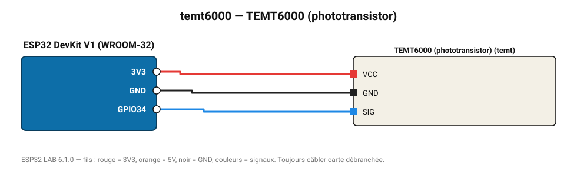

# TEMT6000 (phototransistor)

Capteur de lumière ambiante calé sur la sensibilité de l'œil humain (0-1000 lx environ).

**Carte :** ESP32 DevKit V1 (WROOM-32) — moniteur série 115200 bauds.

| ESP32 | Composant | Broche | Couleur fil | Remarque |
|---|---|---|---|---|
| 3V3 | TEMT6000 (phototransistor) | VCC | rouge |  |
| GND | TEMT6000 (phototransistor) | GND | noir |  |
| GPIO34 | TEMT6000 (phototransistor) | SIG | bleu |  |

Toujours câbler **carte débranchée**. Masse (GND) commune entre tous les modules.
